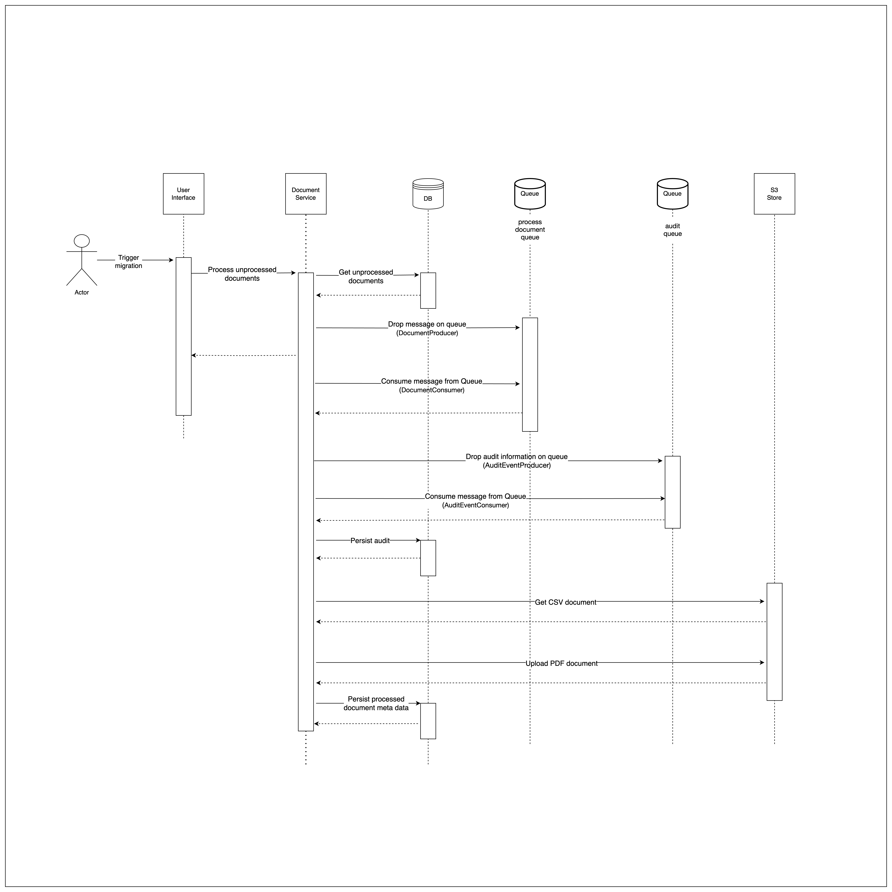

# DocumentService

This project was tested in java version 21

## Setup Database

I am using a docker image for the postgres database, so you can run the below command

Run `podman run --name postgres-container -e POSTGRES_PASSWORD=postgres -d -p 5432:5432 postgres`

## Setup Queues

I am using the localstack docker image, so you will need to cd into the docker folder and run the below:

To start run: `podman compose up`

To shutdown run: `podman compose down`

Once it is up then run the below to create the queues:

run `awslocal sqs create-queue --queue-name process-document-queue`

run `awslocal sqs create-queue --queue-name audit-queue`

## Setup S3 bucket

Start up the localstack as mentioned above then run the below:

run `awslocal s3api create-bucket --bucket assessment-bucket`

## Start up application

please run `mvn clean install` and then run `mvn spring-boot:run -Dspring-boot.run.profiles=local`

## Test Users

You can use test users "User1", "User2" and "User3". The password for all 3 users is "Password123"

## Running unit tests

Run `mvn test` to kick off the unit tests

## Process

The flow diagram below demonstrates the process on a high level

